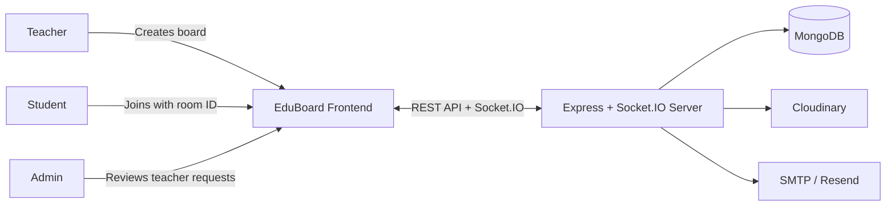
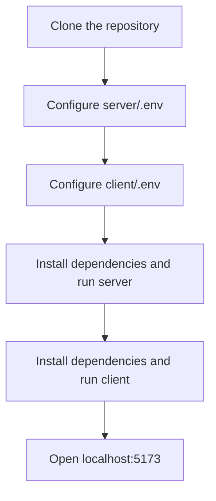

<div align="center">
	<h1> EduBoard</h1>
	<p><strong>Real-time collaborative whiteboard platform for modern classrooms</strong></p>
	<p>Teachers create live board sessions, students join with room codes, and admins review teacher verification requests.</p>
</div>


<p align="center">
	
	
	
	
	
</p>

EduBoard is a full-stack collaborative whiteboard platform built for modern classrooms. Teachers can create live board sessions, students can join with a room code and collaborate in real time, and admins can review teacher verification requests before granting access.

> This README is intentionally structured for beginner contributors so you can understand the codebase quickly, find the main entry points, and run the project locally without unnecessary guesswork.

<p align="center">
	<a href="https://eduboard01.vercel.app/">Live Demo</a>
	·
	<a href="./TECHNICAL_DOCUMENTATION.md">Technical Documentation</a>
	·
	<a href="https://github.com/KENZY004/Eduboard">Repository</a>
</p>


### 🏅 Official GSSoC 2026 Acceptance
<div align="center">
	
</div>

<div align="center">
	
</div>

<a id="quick-navigation"></a>

## 🧭 Quick Navigation

| Section | Link |
| --- | --- |
| Overview | [Go to Overview](#overview) |
| Features | [Go to Features](#features) |
| Tech Stack | [Go to Tech Stack](#tech-stack) |
| Deployment | [Go to Deployment](#deployment) |
| Visual Guide | [Go to Visual Guide](#visual-guide) |
| Project Structure | [Go to Project Structure](#project-structure) |
| Local Setup | [Go to Local Setup](#local-setup) |
| Helpful Scripts | [Go to Helpful Scripts](#helpful-scripts) |
| Main Product Flows | [Go to Main Product Flows](#main-product-flows) |
| API Overview | [Go to API Overview](#api-overview) |
| Contributing | [Go to Contributing](#contributing) |

<a id="overview"></a>

## 📘 Overview

EduBoard combines classroom collaboration and admin moderation in one project:

- Teachers create boards and manage classroom sessions.
- Students join sessions with a room ID and can save board snapshots to their dashboard.
- Admins review teacher document submissions and approve or reject accounts.
- The whiteboard syncs drawing activity, theme changes, cursors, and viewport updates in real time.

## 🌱 Why This Project Is Useful for Contributors

- The frontend and backend are split cleanly into `client/` and `server/`.
- Routing, authentication, and role-based access are easy to trace.
- Mongoose models map directly to the product workflow.
- Real-time collaboration is isolated inside the whiteboard and Socket.IO logic.
- The codebase covers practical full-stack topics: auth, uploads, email, WebSockets, dashboards, and admin tools.

<a id="features"></a>

## ✨ Features

- Real-time whiteboard collaboration using Socket.IO.
- Live drawing, cursor sync, viewport sync, and canvas updates.
- Role-based access for Students, Teachers, and Admins.
- Teacher approval workflow with document upload and email verification support.
- Image uploads stored securely using Cloudinary.
- Responsive classroom interface with export support and saved boards.

<a id="tech-stack"></a>

## 🛠️ Tech Stack

**Frontend:** React 19, Vite, Tailwind CSS, React Router, Framer Motion, Axios, Socket.IO Client, jsPDF  
**Backend:** Node.js, Express 5, Socket.IO, Mongoose, bcryptjs, JSON Web Token  
**Database:** MongoDB  
**Services:** Cloudinary, Nodemailer SMTP, Resend  

<a id="deployment"></a>

## 🚀 Deployment

- Frontend deployed on **Vercel**
- Backend deployed on **Render**
- Database hosted on **MongoDB Atlas**

<a id="visual-guide"></a>

## 🗺️ Visual Guide

### ⚙️ How EduBoard Works



### 🧪 Local Setup Flow



## 🏗️ Architecture At A Glance

```text
Browser (React + Vite)
        |
        | HTTP + WebSocket
        v
Express API + Socket.IO Server
        |
        +--> MongoDB for users, boards, saved boards, and verification data
        +--> Cloudinary for image and document uploads
        +--> SMTP / Resend for account and verification emails
```

## 👥 User Roles

| Role | What they can do |
| --- | --- |
| Student | Join boards with a room code, collaborate when permitted, and save board copies to the dashboard |
| Teacher | Create boards, manage live classroom sessions, share board access, and control editing permissions |
| Admin | Review teacher verification requests, approve or reject teachers, and manage platform users |

<a id="project-structure"></a>

## 📁 Project Structure

```text
EduBoard/
├── client/
│   ├── src/
│   │   ├── components/      # Reusable UI pieces, including the whiteboard and footer
│   │   ├── context/         # Theme context
│   │   ├── lib/             # API client configuration
│   │   ├── pages/           # Landing, auth, dashboard, admin, and info pages
│   │   ├── App.jsx          # Main routing and protected routes
│   │   └── main.jsx         # Frontend entry point
│   └── package.json
├── server/
│   ├── config/              # Cloudinary configuration
│   ├── models/              # User, Board, SavedBoard, TeacherVerification
│   ├── routes/              # Auth, admin, image, and verification routes
│   ├── services/            # Email delivery logic
│   ├── utils/               # Token, admin, and ownership middleware
│   ├── index.js             # Express app, board APIs, and Socket.IO events
│   ├── .env.example         # Starter server environment file
│   └── package.json
├── README.md
└── TECHNICAL_DOCUMENTATION.md
```

## 🧑‍💻 Start Here as a Contributor

If you are new to the codebase, these files are the best entry points:

- [client/src/App.jsx](./client/src/App.jsx) for route structure and protected routes.
- [client/src/pages/Dashboard.jsx](./client/src/pages/Dashboard.jsx) for teacher vs student behavior.
- [client/src/components/Whiteboard.jsx](./client/src/components/Whiteboard.jsx) for real-time canvas logic.
- [server/index.js](./server/index.js) for API setup, board endpoints, and Socket.IO events.
- [server/routes/auth.js](./server/routes/auth.js) for login and registration.
- [server/routes/verificationRoutes.js](./server/routes/verificationRoutes.js) for teacher document workflows.
- [server/routes/adminRoutes.js](./server/routes/adminRoutes.js) for admin moderation.
- [server/models](./server/models) for the database schema layer.

<a id="local-setup"></a>

## ⚙️ Local Setup

### ✅ Prerequisites

- Node.js 18 or later
- npm
- A MongoDB connection string
- A Cloudinary account for uploads
- SMTP credentials or a Resend API key for email flows

### 1. 📥 Clone the repository

```bash
git clone https://github.com/KENZY004/Eduboard.git
cd Eduboard
```

### 2. 🖥️ Configure the server

Create `server/.env` using `server/.env.example` as a base, then update it with your local values.

Recommended server environment variables:

```env
MONGODB_URI=your_mongodb_connection_string
JWT_SECRET=your_jwt_secret
PORT=5000
CLIENT_URL=http://localhost:5173

ADMIN_EMAIL=your_admin_email@example.com
USE_GMAIL=true

SMTP_HOST=smtp.gmail.com
SMTP_PORT=587
SMTP_USER=your_email@gmail.com
SMTP_PASS=your_app_password

RESEND_API_KEY=your_resend_api_key

CLOUDINARY_CLOUD_NAME=your_cloud_name
CLOUDINARY_API_KEY=your_cloudinary_api_key
CLOUDINARY_API_SECRET=your_cloudinary_api_secret
```

Notes:

- For local development, `USE_GMAIL=true` is the simplest email option.
- If you use Resend instead, set `USE_GMAIL=false` and provide `RESEND_API_KEY`.
- Cloudinary is required for teacher document uploads and whiteboard image uploads.

### 3. 💻 Configure the client

Create `client/.env` with the backend URL:

```env
VITE_API_BASE_URL=http://localhost:5000
```

### 4. ▶️ Install dependencies and start both apps

Run the backend:

```bash
cd server
npm install
npm run dev
```

In a second terminal, run the frontend:

```bash
cd client
npm install
npm run dev
```

Open `http://localhost:5173` in your browser.

<a id="helpful-scripts"></a>

## 🧰 Helpful Scripts

### 💻 Client

| Command | Description |
| --- | --- |
| `npm run dev` | Starts the Vite development server |
| `npm run build` | Creates a production build |
| `npm run preview` | Previews the production build locally |

### 🖥️ Server

| Command | Description |
| --- | --- |
| `npm run dev` | Starts the Express server with Nodemon |
| `npm start` | Starts the server without reload support |
| `node create_admin.js` | Creates or promotes the default admin account |
| `node check_pending_teachers.js` | Lists teacher verification requests in the database |
| `node seed_roles.js` | Seeds sample users and clears existing users first |
| `node reset_db.js` | Clears saved board data from the board collection |

<a id="main-product-flows"></a>

## 🔄 Main Product Flows

### 🔐 Authentication and onboarding

1. Users sign up as students or teachers.
2. Teachers upload verification documents after registration.
3. Teachers wait on the verification page until an admin approves or rejects the request.
4. Approved users sign in and are routed to the correct dashboard.

### 🤝 Classroom collaboration

1. A teacher creates a board from the dashboard.
2. The board receives a unique room ID.
3. Students join with that room ID.
4. Drawing events, cursors, and board state sync over Socket.IO.
5. Students can save a copy of board content to revisit later.

### 🛡️ Admin moderation

1. Admins open the admin panel.
2. Pending teacher requests are loaded with uploaded documents.
3. Admins approve or reject requests.
4. The platform sends follow-up email notifications automatically.

<a id="api-overview"></a>

## 🌐 API Overview

The main backend surfaces are:

| Route Group | Purpose |
| --- | --- |
| `/api/auth` | Registration and login |
| `/api/boards` | Board creation, retrieval, deletion, and saved boards |
| `/api/verification` | Teacher document upload and approval status |
| `/api/admin` | Teacher review and user management |
| `/api/images` and `/api/upload` | File and image uploads |

## 📚 Documentation

- [TECHNICAL_DOCUMENTATION.md](./TECHNICAL_DOCUMENTATION.md) contains a deeper architecture and data-flow breakdown.
- [server/.env.example](./server/.env.example) contains the starter backend environment template.

<a id="contributing"></a>

## 🤝 Contributing

Contributions are welcome. If you want to work on EduBoard:

1. Fork the repository.
2. Create a focused branch for your fix or feature.
3. Test both the frontend and backend locally when your change affects runtime behavior.
4. Open a pull request with a clear summary, screenshots if the UI changes, and notes about testing.

## 🔗 Live Demo

<div>
	<a href="https://eduboard01.vercel.app/"><strong>Open the live EduBoard app</strong></a>
</div>
